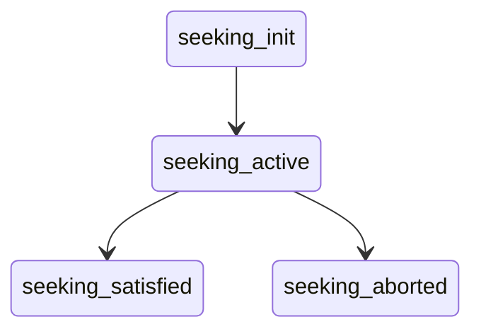

"""MARKDOWN
# Seeking / Beacon Format

This document defines the JSONL beacon format and related files used by the seeking subsystem.

## File: beacons.jsonl
Each line is an independent JSON object.

Minimum fields:
- `stream_id` (string)
- `state` (string) — lifecycle states: `seeking_init` -> `seeking_active` -> (`seeking_satisfied` | `seeking_aborted`)
- `ts` (int or float, unix epoch ms preferred) — optional but recommended

Optional fields:
- `listener_id`
- `reason` / `error`
- `payload` (arbitrary diagnostic dict)

Example line:
```json
{"stream_id":"alpha","state":"seeking_active","ts":1724871000123,"listener_id":"L1"}
```

### State Transitions

Rules:
- Only one active `seeking_*` per stream at a time
- A terminal `seeking_satisfied` or `seeking_aborted` may be followed by a new `seeking_init` to restart

## File: subscriptions.json
A single JSON object keyed by `stream_id`.

```json
{
  "alpha": {"since": 1724871000, "filters": ["tag:foo"]},
  "beta": {}
}
```

## Health Checks Mapping
| Key                  | Meaning                                      |
|----------------------|----------------------------------------------|
| python_version       | Runtime version & recommendation             |
| env:*                | Presence of environment variables            |
| runtime_dir_writable | Ability to create files in runtime directory |
| beacons_file         | Beacon file existence / read status          |
| beacons_parse        | Parse ratio for last ≤500 lines              |
| beacon_shape         | Structural completeness (state + stream_id)  |
| subscriptions_file   | subscriptions.json status & key count        |
| target_stream        | Presence of seeking beacon for TARGET_STREAM_ID |
| import:core.beacon_writer | Module import status                   |

## Environment Variables
| Variable                       | Purpose                                 |
|--------------------------------|-----------------------------------------|
| NOISE_SEEK_BEACON_PATH         | Path to `beacons.jsonl`                 |
| NOISE_SEEK_SUBSCRIPTIONS_PATH  | Path to `subscriptions.json`            |
| TARGET_STREAM_ID               | Stream of interest for health summary   |
| LISTENER_ID                    | Emitter identification tag              |

## Using the Health Tool
Human readable:
```
python -m core.health
```
JSON output:
```
python -m core.health --json | jq
```

## Smoke / Demo
Run the smoke script to generate a minimal sequence:
```
python scripts/smoke_beacons.py
python -m core.health
```
"""